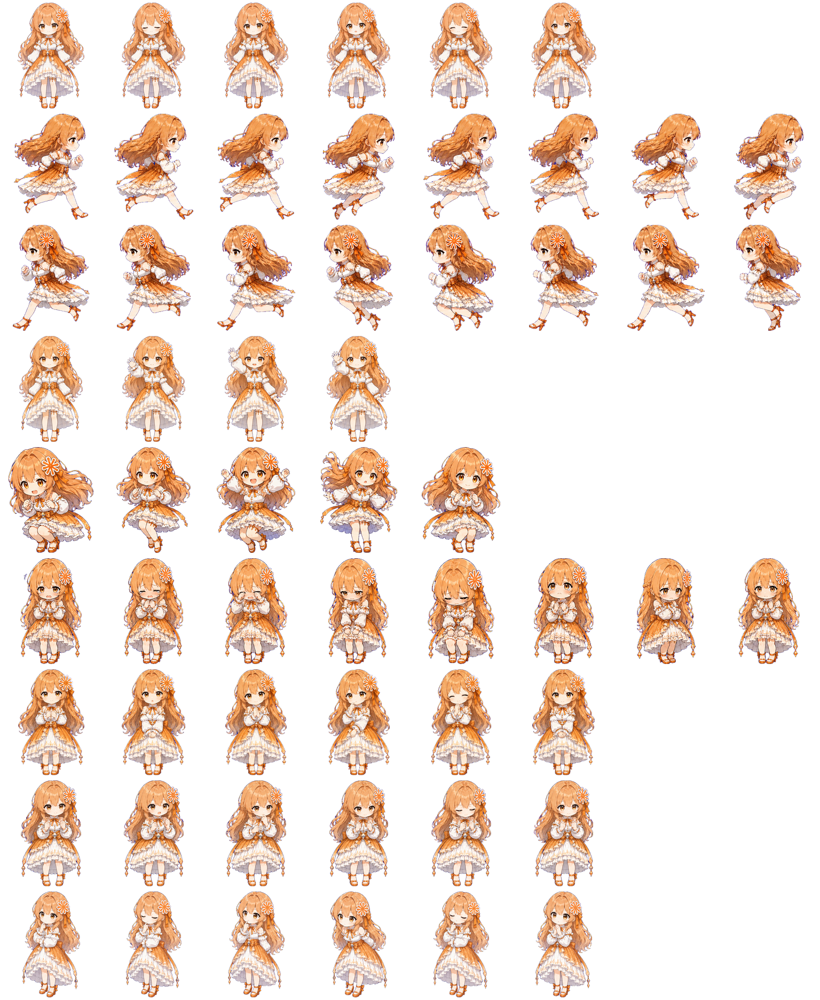

# OpenPet AI Girls

[](./README.md)
[](./README.zh-CN.md)

Anime-style AI gijinka pet assets for [OpenPet](https://github.com/AwesomeHou/OpenPet) and Codex pets.

This repository is a ready-to-use pet asset pack featuring anthropomorphized versions of well-known AI assistants:

- `DeepSeek`
- `Doubao`
- `Gemini`
- `ChatGPT`
- `Claude`

Each pet is packaged in a simple folder format that is easy to use in OpenPet projects and also fits Codex pet asset conventions.

For Simplified Chinese documentation, see [README.zh-CN.md](./README.zh-CN.md).

OpenPet AI Girls is a small public asset pack for AI-themed companion pets. It is designed for [OpenPet](https://github.com/AwesomeHou/OpenPet), works with Codex pets data structures, and is intended for personal projects, demos, and experimental companion UI workflows.

## Preview

| DeepSeek | Doubao |
| --- | --- |
|  |  |

| Gemini | ChatGPT |
| --- | --- |
|  |  |

| Claude |
| --- |
|  |

## Overview

This repository is intended for public showcase, reference, and pet experiment workflows.

- Built for [OpenPet](https://github.com/AwesomeHou/OpenPet)
- Structured to also work as Codex custom pet assets
- Includes per-pet metadata and spritesheet assets
- Focused on anime-style AI girl character designs

## Included Pets

| ID | Display Name | Style Summary |
| --- | --- | --- |
| `deepseek` | DeepSeek | Blue-haired, elegant, starry blue-and-white outfit |
| `doubao` | Doubao | Black-and-white lolita style, short dark bob |
| `gemini` | Gemini | Rainbow-haired, bright and cheerful design |
| `chatgpt` | ChatGPT | Mint-green palette, white-and-teal dress |
| `claude` | Claude | Peach-orange hair, white frilled dress, orange ribbons |

## Repository Structure

```text
openpet-ai-girls/
├─ deepseek/
│  ├─ pet.json
│  └─ spritesheet.webp
├─ doubao/
│  ├─ pet.json
│  └─ spritesheet.webp
├─ gemini/
│  ├─ pet.json
│  └─ spritesheet.webp
├─ chatgpt/
│  ├─ pet.json
│  └─ spritesheet.webp
├─ claude/
│  ├─ pet.json
│  └─ spritesheet.webp
├─ README.md
└─ README.zh-CN.md
```

Each pet folder contains:

- `pet.json`: pet metadata
- `spritesheet.webp`: the spritesheet image used by the pet runtime

## Metadata Format

Each `pet.json` currently follows this structure:

```json
{
  "id": "deepseek",
  "displayName": "DeepSeek",
  "description": "A graceful blue-haired anime girl mascot pet...",
  "spritesheetPath": "spritesheet.webp"
}
```

Field meanings:

- `id`: unique pet identifier
- `displayName`: human-readable pet name
- `description`: short character description
- `spritesheetPath`: relative path to the spritesheet asset

## Quick Start

### Use in OpenPet

1. Import the pet asset into [OpenPet](https://github.com/AwesomeHou/OpenPet).
2. Bind the pet to the AI site where you want it to appear.
3. Make sure `Show Pet Overlay` is enabled.

### Use in Codex Pets

1. Put the pet folder into your Codex pets directory.

   Common locations:

   - Windows: `%USERPROFILE%\.codex\pets`
   - macOS: `~/.codex/pets`

   Or open Codex and go to `Settings -> Appearance -> Pets`, then use the custom pets section to open the pets folder directly.

2. In Codex, go to `Settings -> Appearance -> Pets`.
3. Select the pet you want to display, then click `Select`.

### Other Projects Compatible with Codex Pets

Any project that follows the Codex pets data structure and uses `pet.json` plus `spritesheet.webp` for pet assets can use each folder in this repository as a starting asset pack.

## Notes

- This repository is focused on asset packaging, not runtime logic.
- Character designs are stylized AI gijinka interpretations made for fun, experimentation, and companion-style usage.
- If your OpenPet or Codex runtime has stricter animation grid requirements, adapt the metadata layer in your target project while keeping the spritesheet assets in place.

## Disclaimer

These pets are unofficial fan-made character interpretations created by me based on the logos, names, and brand impressions of various AI products.

This repository is not affiliated with, endorsed by, or sponsored by the official teams behind those AI products. All related product names, logos, and brand elements remain the property of their respective rights holders.

No warranty is provided for the assets in this repository. They are shared for viewing, reference, and personal appreciation in the repository context only.

If you are a rights holder or an authorized representative and would like a specific pet removed or adjusted, please open a [GitHub Issue](https://github.com/AwesomeHou/openpet-ai-girls/issues). Issues are the default public feedback channel for this repository and help keep requests traceable.
