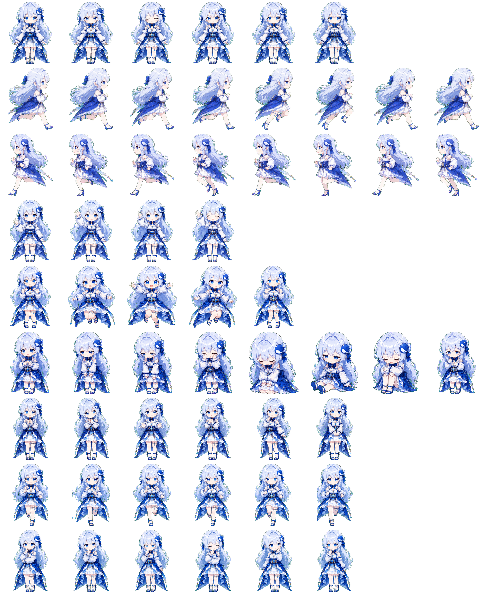
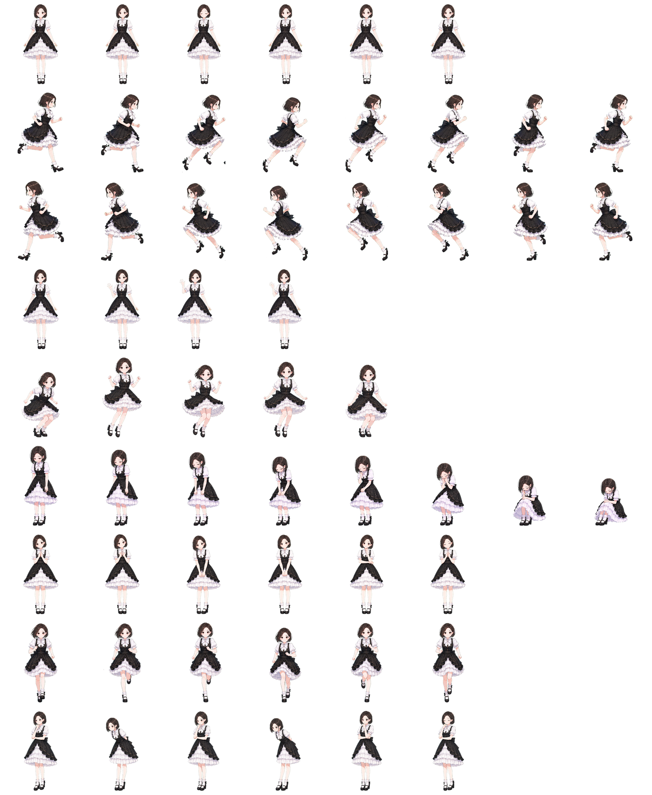
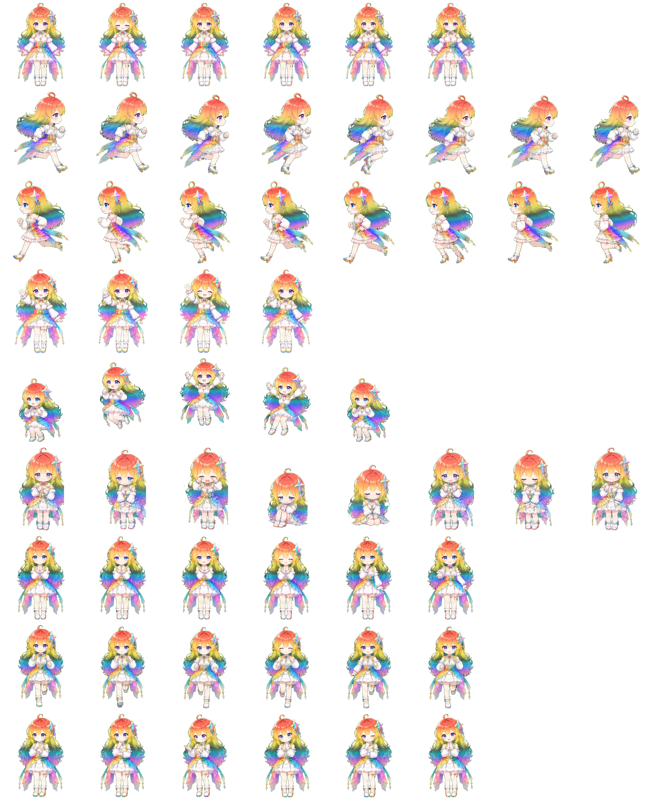
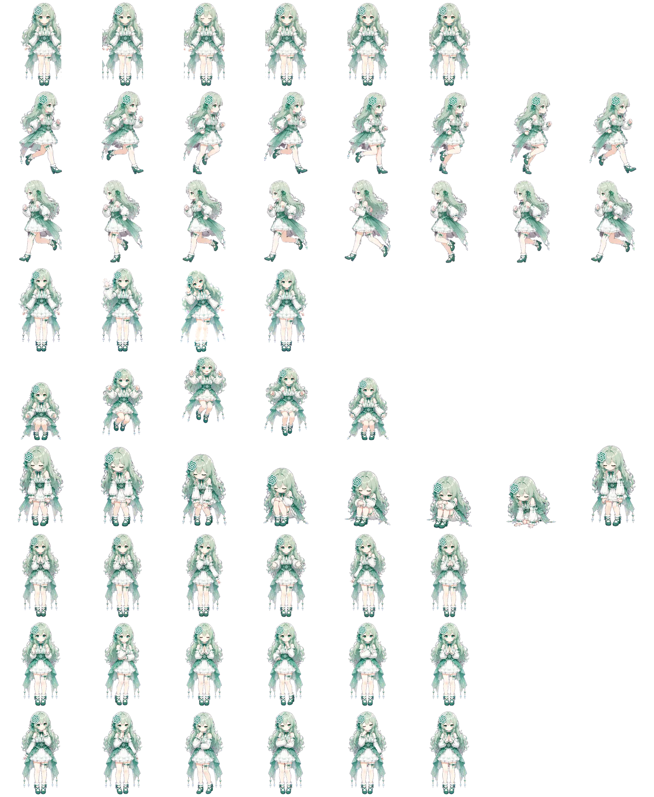

# OpenPet AI Girls

[](./README.md)
[](./README.zh-CN.md)

适用于 [OpenPet](https://github.com/AwesomeHou/OpenPet) 与 Codex pets 的 AI 拟人娘化宠物资产库。

这个仓库收录了一组可直接复用的宠物素材，主题是将常见 AI 助手做成二次元拟人娘化角色，目前包含：

- `DeepSeek`
- `Doubao`
- `Gemini`
- `ChatGPT`

每个宠物都采用统一目录格式组织，方便直接接入 OpenPet 项目，也适合作为 Codex pets 自定义宠物资产的基础使用。

For the English version, see [README.md](./README.md).

OpenPet AI Girls 是一个面向公开发布的小型宠物素材仓库，聚焦 AI 主题陪伴型角色资产。它主要为 [OpenPet](https://github.com/AwesomeHou/OpenPet) 设计，也兼容采用 Codex pets 数据结构的项目，适合个人项目、演示项目与实验性 companion UI 场景使用。

## 预览

| DeepSeek | Doubao |
| --- | --- |
|  |  |

| Gemini | ChatGPT |
| --- | --- |
|  |  |

## 项目说明

这个仓库的定位是一个适合公开展示与参考使用的宠物素材包，适合个人项目、演示项目，或者作为后续扩展更多宠物资产的基础仓库。

- 面向 [OpenPet](https://github.com/AwesomeHou/OpenPet) 使用场景
- 同时兼容 Codex pets 的基础资产组织方式
- 每个宠物都包含独立元信息和 spritesheet
- 角色风格为 AI 拟人娘化二次元形象

## 已包含角色

| ID | 显示名 | 风格简介 |
| --- | --- | --- |
| `deepseek` | DeepSeek | 蓝发、星空感配色、偏优雅气质 |
| `doubao` | Doubao | 黑白洛丽塔风、短深色发型 |
| `gemini` | Gemini | 彩虹发色、明亮活泼风格 |
| `chatgpt` | ChatGPT | 薄荷绿主色、白绿服饰设计 |

## 仓库结构

```text
openpet-ai-girls/
├─ deepseek/
│  ├─ pet.json
│  └─ spritesheet.webp
├─ doubao/
│  ├─ pet.json
│  └─ spritesheet.webp
├─ gemini/
│  ├─ pet.json
│  └─ spritesheet.webp
├─ chatgpt/
│  ├─ pet.json
│  └─ spritesheet.webp
├─ README.md
└─ README.zh-CN.md
```

每个宠物目录都包含：

- `pet.json`：宠物元信息
- `spritesheet.webp`：宠物动作或帧图使用的 spritesheet 资源

## 元信息格式

当前每个 `pet.json` 基本结构如下：

```json
{
  "id": "deepseek",
  "displayName": "DeepSeek",
  "description": "A graceful blue-haired anime girl mascot pet...",
  "spritesheetPath": "spritesheet.webp"
}
```

字段含义如下：

- `id`：宠物唯一标识
- `displayName`：显示名称
- `description`：宠物形象描述
- `spritesheetPath`：spritesheet 相对路径

## 快速开始

### 在 OpenPet 中使用

1. 将宠物资产导入 [OpenPet](https://github.com/AwesomeHou/OpenPet)。
2. 将该宠物与目标 AI 站点绑定。
3. 确保“显示宠物浮层”处于开启状态。

### 在 Codex pets 中使用

1. 将宠物文件夹放入 Codex 的 pets 目录。

   常见路径：

   - Windows：`%USERPROFILE%\.codex\pets`
   - macOS：`~/.codex/pets`

   或者打开 Codex，进入 `Settings -> Appearance -> Pets`，在自定义 pets 区域直接打开该文件夹。

2. 打开 Codex，进入 `Settings -> Appearance -> Pets`。
3. 选择你想显示的 pet，然后点击 `Select`。

### 其它兼容 Codex pets 格式的项目

凡是遵循 Codex pets 的数据结构、使用 `pet.json` 与 `spritesheet.webp` 组织宠物资源的项目，都可以将本仓库中的单个宠物目录直接作为起始素材使用。

## 适用场景

- OpenPet 项目的宠物角色资源
- Codex pets 的自定义宠物素材
- AI 主题角色化展示
- 个人收藏、演示、实验性项目

## 说明

- 这个仓库聚焦于“资产内容本身”，不包含运行时逻辑。
- 角色属于对 AI 助手的二创拟人化表达，适合陪伴型、展示型和实验型项目使用。
- 如果你的 OpenPet 或 Codex 运行时对动画切图网格、尺寸、帧序有更严格要求，建议在目标项目侧补齐对应元数据或适配逻辑。

## 免责声明

这些宠物均为我基于各类 AI 产品的 logo、名称与品牌印象创作的非官方二创拟人化形象。

本仓库与相关 AI 产品的官方团队不存在隶属、背书、赞助或授权关系。相关产品名称、logo 与品牌元素的权利仍归各自权利人所有。

本仓库中的资产按“现状”展示，不提供任何明示或默示担保。当前分享目的主要是仓库展示、参考与个人欣赏。

如果你是相关权利人或授权代表，并希望移除或调整其中某只宠物，请通过 [GitHub Issues](https://github.com/AwesomeHou/openpet-ai-girls/issues) 与我联系。Issues 是本仓库当前默认的公开反馈通道，便于跟踪处理进展。
